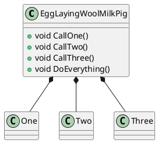

# What unit tests tell us about the architecture
Typically, we write unit tests to make sure that the software does behave as expected.

There is one more aspect about unit tests that allows us to gain insight into the current state of software architecture (or software design).
## UML way

## Test setup way
```c++
  // arrange
  std::shared_ptr<OneMock> one = std::make_shared<OneMock>();
  std::shared_ptr<TwoMock> two = std::make_shared<TwoMock>();
  std::shared_ptr<ThreeMock> three = std::make_shared<ThreeMock>();
  EXPECT_CALL(*one, IsFirst()).WillOnce(Return(true));
  EXPECT_CALL(*two, IsEven()).WillOnce(Return(true));
  EXPECT_CALL(*three, IsFibonacci()).WillOnce(Return(true));
```
Have a look at the unit test setup code (the arrange block).

You should become suspicious...
* if the arrange block gets huge
* if the arrange block gets complicated
* if the arrange block gets interconnected


