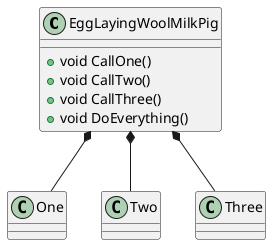

# What unit tests tell us about the architecture

## Why do we write unit tests?
Typically, we write unit tests to make sure that the software does behave as expected.

There is one more aspect about unit tests that allows us to gain insight into the current state of software architecture (or software design).
## Model the classes in UML

## Model the classes in unit tests
### Prerequisites
Isolate the "unit under test" by mocking its dependencies (solitary tests)  

### Focus on the arrange block
```c++
  // arrange
std::shared_ptr<OneMock> one = std::make_shared<OneMock>();
EXPECT_CALL(*one, IsFirst()).WillOnce(Return(true));
EggLayingWoolMilkPig sut(one, std::make_shared<TwoMock>(), std::make_shared<ThreeMock>());

// act
bool actual = sut.CallOne();

// assert
EXPECT_TRUE(actual);
```
Have a look at the unit arrange block (test setup).

You should become suspicious...
* if the arrange block gets huge
* if the arrange block gets complicated
* if the arrange block gets interconnected


