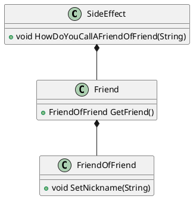

# Single responsibility
> every class should have only one reason to change

You should become suspicious...
* when you have to mock a lot of members  
-> ok, it could still be a facade
* when you have to write a lot of expect statements

## Side effects

